# 基于Python的小说网站数据分析系统的设计与实现

> 公开脱敏版：保留论文正文与技术插图；学校模板、页眉页脚、校徽、身份元数据不进入公开文件，含个人资料或凭据的截图已隐藏。

目 录

## 绪论

### 选题背景与意义

随着互联网的普及和发展，网络上的小说阅读越来越受到人们的关注和喜爱。纵横小说网站是国内最具影响力的小说网站之一，拥有众多作者和读者，提供了海量的小说资源。本论文选题旨在利用大数据分析与处理技术，对纵横小说网站的数据进行深入研究和分析，具有以下重要意义：

首先，研究纵横小说网站数据有助于了解当前阅读市场的趋势和需求。通过对小说作品进行分析，可以发现受欢迎的小说类型、作者、题材等信息，为读者提供更加精准的推荐和选择。同时，对排行榜的变化趋势进行监测，对于网站的运营者来说，能够及时把握读者的偏好，优化推荐算法，提升用户体验。

其次，通过大数据分析纵横小说网站数据，可以挖掘出潜在的优秀作者和作品。从大数据中发现作者的创作规律、读者的评价和反馈，从而对作者的创作风格、作品质量等进行评估和筛选。同时，对于作品的分析还能发现用户阅读的偏好，有助于引导作家创作更符合读者需求、更受欢迎的小说作品。

最后，本研究对于提升信息处理和技术应用能力也具有重要意义。在研究中，将应用大数据分析和处理技术对海量的纵横小说网站数据进行整理和统计。这对于数据处理、模型建立、算法优化等方面提出了挑战，有助于提升相关技术的研究与应用水平。

综上所述，本论文选题有助于了解阅读市场趋势、发现潜在优秀作者和作品，并且提升信息处理和技术应用能力。通过对纵横小说网站大数据的研究与分析，对于读者、作者和网站运营者都具有实际意义，有助于优化用户体验、推动文学创作和满足人们对优质小说的需求。

### 国内外发展现状

在国内，已经有一些学者对小说网站的数据进行了研究。其中，一些研究集中在数据的分析与挖掘上，通过利用机器学习和数据挖掘算法，提取出受欢迎的小说类型、作者及其特征等信息。另外，还有研究关注数据和用户行为之间的关联，通过分析用户的浏览、阅读和评论等行为数据，揭示了数据对用户选择和阅读行为的影响。

在国外，对于大数据分析与处理在小说阅读平台的应用研究也有一定的进展。一些研究关注于小说网站的内容推荐系统，利用协同过滤算法、模型推荐等方法，为用户提供个性化的推荐服务。此外，还有研究聚焦于对小说作者和作品的分析，通过挖掘大数据，发现了作者的创作规律、作品的热度趋势以及读者的喜好等方面的信息。

综上所述，国内外研究者对纵横小说网站大数据的习通分析与处理已经有了一定的探索和研究。国内学者主要关注数据的分析与挖掘以及与用户行为的关联，而国外研究则更加注重小说作品的推荐及作者创作规律的发现。然而，纵横小说网站大数据的习通分析与处理仍然存在着许多问题和挑战，例如数据准确性、算法精确度、用户隐私保护等方面，因此该领域仍有待进一步的研究和探索。

### 研究内容

数据收集和清理：该研究涉及使用Python网络抓取技术从纵横小说网站收集数据。随后，进行彻底的数据清洗过程，以确保数据集的准确性和可靠性。

MySQL数据库中的数据存储：收集和清理的数据有效地存储在MySQL数据库中。这可确保数据井然有序且易于分析。

使用Spark SQL进行深度数据分析：该研究采用Spark SQL进行全面的数据分析。这涉及探索数据集中的用户阅读偏好和趋势，为平台上读者的行为提供有价值的见解。

交互式数据呈现系统：建立了交互式数据呈现系统，后端采用Spring Boot，前端采用Vue。该系统允许用户通过各种方式可视化数据，增强他们对分析信息的理解。

数据生成请求：用户可以通过系统发起数据生成请求。此功能为研究添加了交互元素，使用户能够根据自己的喜好生成特定数据。

历史任务结果：用户还可以通过系统查看历史任务结果。此功能为用户提供了比较和分析不同数据生成请求的结果的参考点。

总体而言，该研究集数据采集、存储、分析、可视化于一体，为了解阅读市场趋势、发现潜在的优秀作者和作品、提升网络文学领域的信息处理和技术应用能力提供了实质性支撑。

## 关键技术介绍

### 关键性开发技术介绍

#### Spring Boot

Spring Boot是Spring框架的进化产物，以其约定大于配置的理念，极大地简化了Spring框架的配置繁琐性。通过引入Spring Boot Starter和结合Maven工具，开发人员能够迅速搭建起整合了Spring、Spring MVC、MyBatis等框架的系统，形成一套高效的SSM框架。

它就像一把魔法钥匙，能够以惊人的速度解锁开发过程中的诸多烦扰。Spring Boot通过一系列默认配置，让开发者可以不再为琐碎的配置而烦恼，而是专注于业务逻辑的实现。它的独特之处在于不仅仅提供了快速搭建的能力，还通过内置Tomcat服务器的方式，使得整个开发过程更加轻松，不再需要额外的服务器配置和部署步骤。

#### Vue

Vue是一种流行的JavaScript前端框架，以其简洁易用、响应式数据绑定、组件化开发等特点而闻名。在本系统中，Vue扮演着关键角色。它帮助开发者构建交互性强、用户友好的界面，通过数据绑定和事件处理实现页面与用户的交互功能，提升用户体验。Vue的组件化开发能够有效管理和复用系统中的功能模块，提高了系统的可维护性和扩展性。同时，Vue的响应式数据绑定机制确保了数据变化时界面的及时更新，保证系统的实时性和准确性。在构建单页面应用时，Vue Router提供了便捷的路由管理工具，使得用户操作更加流畅和自然。

#### MySQL数据库

MySQL是一种流行的关系型数据库管理系统，以其高性能、稳定性和开源免费等特点而广泛应用。MySQL支持SQL语言，能够存储和管理大量结构化数据，适用于各种规模的应用场景。

通过MySQL的高效存储和检索功能，可以快速地对数据进行增删改查操作，保证了系统的数据安全和完整性。其次，MySQL提供了可靠的事务处理机制，保证了数据的一致性和可靠性，避免了数据丢失或损坏的风险。此外，MySQL还支持数据备份和恢复功能，能够在系统发生故障时快速恢复数据，保障系统的稳定运行。

#### Python

Python 是一种高级、动态类型的编程语言，自从 1991 年首次发布以来，已经成为全球范围内广泛应用的编程语言之一。Python 的特点包括简洁、易读、可扩展性强，以及拥有庞大的开源社区。这些优势使得 Python 成为了开发网络安全检测系统的理想选择。

Python 语法简洁、易读，有助于提高开发效率，降低维护成本。这种简洁性使得 Python 代码更容易理解和修改，对于开发网络安全检测系统这样需要频繁更新和维护的项目而言，Python 的易用性大大提高了开发效率。

Python 拥有强大的标准库和丰富的第三方库，这些库为开发者提供了许多现成的功能和工具，可以大大减少开发工作量。在网络安全领域，Python 社区已经为开发者提供了大量的安全相关库，如 Requests、BeautifulSoup、Scrapy 等用于网络爬虫，Nmap、Scapy 等用于网络扫描，以及 Django、Flask 等 Web 框架。这些库简化了网络安全检测系统的开发过程，为开发者提供了丰富的资源。

#### Requests

Requests 是 Python 中一个非常流行的 HTTP 请求库，简洁易用，旨在简化 Web 请求的操作。它是构建爬虫、数据抓取、API 调用等应用程序时的基础库之一。与 Python 标准库中的 urllib 相比，Requests 提供了更直观、简洁的 API，使得 HTTP 请求变得更容易实现和管理。

在爬虫开发中，Requests 的作用非常重要。它可以帮助开发者发送 HTTP 请求，从互联网上获取数据，进而进行解析和分析。无论是 GET 请求（如获取网页内容）还是 POST 请求（如提交表单数据），Requests 都能够轻松处理。

### 其它相关技术

#### HTTP请求

HTTP（Hypertext Transfer Protocol）是一种用于传输超文本数据的应用层协议，它是Web的基础之一。通过HTTP协议，客户端（通常是浏览器）可以向服务器发送请求，并从服务器接收响应，实现了客户端与服务器之间的通信和数据交换。

HTTP请求技术通过定义不同的请求方法（如GET、POST、PUT、DELETE等），实现了对不同操作的标准化和规范化，确保了请求的准确性和有效性。其次，HTTP请求技术支持在请求头中添加各种参数和信息，如请求头、请求体、Cookie等，可以传递用户身份认证信息、请求参数等，从而实现了用户身份的验证和数据的传递。此外，HTTP请求技术还支持跨域请求、文件上传、会话管理等功能。

#### Spark SQL

SparkSQL是ApacheSpark生态系统的强大组件，它提供了用于查询结构化和半结构化数据的简化接口。它扩展了核心Spark引擎以支持SQL查询，从而可以更轻松地在分布式计算环境中处理结构化数据和非结构化数据。SparkSQL支持多种数据源，包括Hive、Parquet、JSON等，能够与现有数据存储系统无缝集成。

SparkSQL的主要功能包括执行SQL查询、数据帧操作以及在结构化和非结构化数据处理之间无缝切换的能力。它通过Catalyst查询优化和Tungsten执行引擎等技术优化查询执行，从而提高性能。此外，它还支持用户定义函数(UDF)并提供与JDBC和ODBC的兼容性，使其成为大数据应用程序中数据处理、分析和报告的多功能工具。

## 系统分析

### 功能性需求分析

本系统旨在创建一个综合的大数据分析和处理平台，专注于纵横小说网站的数据。系统的核心目标是以Python为主要开发语言，通过编写自动化爬虫程序，实现对纵横小说网站上的所有数据的抓取和提取。这包括小说的简介内容、作者信息、榜单信息、读者评论数据等等。

因此本系统业务主要分为三大模块：数据爬取，清洗，存储，分析结果展示，为了保证本系统中所有数据的安全，系统中的分析结果查看，数据爬取，数据清洗等操作都需要用户登录后才可以使用，因此本系统的用例图如图3.1所示。

图3.1 用例图

数据爬取用例中，实时爬取共分为三大类：点击榜，推荐榜，月票榜，纵横小说网会对点击榜与推荐榜进行每天，每周，每月的更新，然后月票榜，纵横小说网每月会进行更新，因此系统需要每天，每月，每周自动对这些榜单数据进行实时爬取获取，用例描述如表3.1所示。

表 3-1 实时爬取

<table>
<tr><td>名称</td><td colspan="2">实时爬取</td></tr>
<tr><td>概述</td><td colspan="2">实时爬取纵横小说网站的数据</td></tr>
<tr><td>参与者</td><td colspan="2">无</td></tr>
<tr><td>前置条件</td><td colspan="2">需要提前准备好实时爬取的Python脚本</td></tr>
<tr><td>基本事件流</td><td>步骤</td><td>活动</td></tr>
<tr><td></td><td>1</td><td>启动系统</td></tr>
<tr><td></td><td>2</td><td>服务端启动定时任务</td></tr>
<tr><td></td><td>3</td><td>系统自动开始实时爬取任务</td></tr>
<tr><td></td><td>4</td><td>爬取到数据后，自动进行清洗与分析，并将结果存入数据库中。</td></tr>
</table>

用户还可以手动开启爬取任务，爬取有关纵横小说网站下的数据，比如爬取书籍信息书籍，爬取评论书籍等，并且可以在爬取任务用例中查看爬取的结果等，具体的用例描述与表3.2所示。

表 3-2 爬取任务管理

<table>
<tr><td>名称</td><td colspan="2">爬取任务管理</td></tr>
<tr><td>概述</td><td colspan="2">创建纵横小说网站爬取任务，并查看任务状态，进行手动执行任务，删除任务，修改任务等操作</td></tr>
<tr><td>参与者</td><td colspan="2">系统用户</td></tr>
<tr><td>前置条件</td><td colspan="2">提前创建好定时任务</td></tr>
<tr><td>基本事件流</td><td>步骤</td><td>活动</td></tr>
<tr><td></td><td>1</td><td>进入爬取任务列表</td></tr>
<tr><td></td><td>2</td><td>创建爬取任务，输入爬取的类型（对应不同的爬取脚本）。</td></tr>
<tr><td></td><td>3</td><td>系统启动后，到时间自动开启运行爬取任务</td></tr>
<tr><td></td><td>4</td><td>用户在任务列表查看任务执行状态与结果，并对任务进行修改，删除，手动执行等操作。</td></tr>
</table>

用户可以在本系统查看清洗后的爬取数据，如表3.3所示。

表 3-3 数据清洗结果

<table>
<tr><td>名称</td><td colspan="2">数据清洗结果</td></tr>
<tr><td>概述</td><td colspan="2">登入系统的用户查看纵横小说网站数据清洗后的结果，并可以对其进行分页，模糊查询</td></tr>
<tr><td>参与者</td><td colspan="2">系统用户</td></tr>
<tr><td>前置条件</td><td colspan="2">登入系统</td></tr>
<tr><td>基本事件流</td><td>步骤</td><td>活动</td></tr>
<tr><td></td><td>1</td><td>点击数据清洗结果按钮</td></tr>
<tr><td></td><td>2</td><td>查看清洗后的数据</td></tr>
<tr><td></td><td>3</td><td>点击分页，进行分页查询</td></tr>
<tr><td></td><td>4</td><td>输入查询字段，对其进行模糊查询</td></tr>
</table>

系统用户通过登录系统，在选择书籍后，系统对书籍评论进行NLP情感分析，并以图形化方式展示积极、消极和中性评论，帮助用户了解读者的情感倾向，用例描述如表3.4所示。

表 3-4评论情感分析

<table>
<tr><td>名称</td><td colspan="2">评论情感分析</td></tr>
<tr><td>概述</td><td colspan="2">通过对书籍的评论语句进行NLP情感分析，筛选出该书籍下积极，消极，中性评论，帮助用户更好的分析读者心路历程</td></tr>
<tr><td>参与者</td><td colspan="2">系统用户</td></tr>
<tr><td>前置条件</td><td colspan="2">登入系统</td></tr>
<tr><td>基本事件流</td><td>步骤</td><td>活动</td></tr>
<tr><td></td><td>1</td><td>用户登入系统</td></tr>
<tr><td></td><td>2</td><td>选择需要被分析的书籍</td></tr>
<tr><td></td><td>3</td><td>系统通过被选择的书籍，读取该书籍的部分评论数据，然后进行NLP分析</td></tr>
<tr><td></td><td>4</td><td>界面展示分析后的结果，并以词云图，饼状图等形式进行图形化展示</td></tr>
</table>

系统用户登录系统，进行书籍分析，系统使用多线程的方式，结合爬取到的各种榜单数据（月票，推荐，点击），对书籍进行分析，展示最受欢迎的书籍，展示书籍字数与榜单之间的关系，如表3.5所示。

表 3-5 书籍分析

<table>
<tr><td>名称</td><td colspan="2">书籍分析</td></tr>
<tr><td>概述</td><td colspan="2">系统选择综合排名前200的书籍，结合这些书籍对应的榜单数据与本身数据，进行分析</td></tr>
<tr><td>参与者</td><td colspan="2">系统用户</td></tr>
<tr><td>前置条件</td><td colspan="2">登入系统</td></tr>
<tr><td>基本事件流</td><td>步骤</td><td>活动</td></tr>
<tr><td></td><td>1</td><td>用户登入系统，选择书籍分析</td></tr>
<tr><td></td><td>2</td><td>系统使用多线程进行不同维度分析</td></tr>
<tr><td></td><td>3</td><td>返回分析结果</td></tr>
<tr><td></td><td>4</td><td>前端通过v-cahrts对分析结果进行可视化展示</td></tr>
</table>

榜单数据分析，月票榜可以直观的展示，纵横中文网中最吸金的小说，因此可以对月票榜单数据进行横向分析，来展示趋势，如表3.6所示。

表 3-6 榜单数据分析

<table>
<tr><td>名称</td><td colspan="2">榜单数据分析</td></tr>
<tr><td>概述</td><td colspan="2">首先展示月票榜前200的书籍词云图，然后用户点击词云图，展示该书籍的月票走势与点击，推荐饼状分析结果</td></tr>
<tr><td>参与者</td><td colspan="2">系统用户</td></tr>
<tr><td>前置条件</td><td colspan="2">登入系统</td></tr>
<tr><td>基本事件流</td><td>步骤</td><td>活动</td></tr>
<tr><td></td><td>1</td><td>登入系统</td></tr>
<tr><td></td><td>2</td><td>前端通过v-charts渲染展示前200名书籍词云</td></tr>
<tr><td></td><td>3</td><td>用户点击词语图中的词语，系统在对该书籍进行分析</td></tr>
<tr><td></td><td>4</td><td>展示分析后的月票走势结果，点击与推荐饼状图</td></tr>
</table>

### 非功能性需求分析

为了保障数据处理速度，数据爬取效率，系统能够及时收集纵横小说网站最新最热数据，系统应该在性能上具有以下需求：

1.响应时间：系统应该能够在毫秒级别内对用户请求做出响应。

2.并发能力：系统应该支持大量的并发请求，以保证用户的访问不会受到限制。

3.数据处理速度：系统应该能够在实时处理大量的数据，以确保数据的及时更新。

本系统的核心业务：爬取纵横小说网站数据，对纵横小说网站数据进行分析，因此避免不了读者信息的捕获，因此本系统在安全上应该具有以下需求：

1.用户数据保护：系统应该保证用户隐私数据的保密性和完整性。

3.系统数据保护：系统应该采用多种安全技术，防止系统被黑客攻击，确保数据的安全性。

并且爬取的纵横小说网站数据应该在法律的允许范围内进行爬取，并且严格保护被爬取的内容，保证用户隐私安全。

### 可行性分析

技术可行性：从技术角度看，系统采用了现代的数据采集、存储和分析技术，包括Python爬虫、Spark SQL、MySQL数据库等。这些技术在实践中已得到广泛应用，具备成熟和稳定的特点，因此系统在技术上是可行的。此外，使用Spring Boot和Vue构建交互式数据展示系统也是合理的选择，这些技术有强大的社区支持，开发效率高，用户体验好。

经济可行性：从经济角度看，系统的开发和维护成本需要考虑。虽然采用了多种先进技术，但开源工具和框架的使用可以降低开发成本。重要的是，系统的预期收益需要超过开发和维护的成本，因此需要考虑用户订阅、广告收入等盈利模式。如果系统能够吸引足够的用户和广告商，从而实现良好的盈利，那么从经济上来说，它也是可行的。

法律可行性：在法律层面，系统需要遵守相关的法律法规，特别是涉及到用户数据的采集和处理。确保用户数据的隐私和安全是至关重要的。此外，需要考虑著作权法和知识产权法等法律，以确保在系统中使用的小说和数据没有侵犯他人的权利。合规性方面需要严格把关，以避免法律风险。

综合来看，从技术、经济和法律角度进行的可行性分析显示，该系统在现实中是可行的，但需要仔细考虑技术实施、经济盈利模式和法律合规性等方面的问题，以确保系统的成功运营和可持续发展。

## 系统设计

### 架构设计

通过上述的需求分析得知，本系统分为四大类：登录，脚本管理，数据爬取，分析结果展示，系统功能结构图如图4.1所示。

图4.1 系统功能结构图

系统采用的架构为B/S架构，服务端由Spring Boot提供，Spring Boot 提供分析结果展示，数据爬取，脚本管理，登录等功能调用逻辑支撑与HTTP通信，Python提供数据爬取，清洗，分析等过程的实施逻辑，Vue提供界面，MySQL数据库提供数据持久化储存，系统的架构图如图4.2所示。

图4.2 系统架构图

### 功能设计

#### 登录

系统管理员用户输入账号与密码进行系统登录，系统服务端对密码进行MD5签名，通过SQL语句对数据库用户表进行条件查询，账号与签名后的密码为条件，对查询的结果进行判断，看是否为Null，如果为Null代表账号或者密码错误，提示用户登录失败，如果不为Null则登录成功，系统通过JWT算法生成Token，与登录后的用户信息一起返回给前端，提示登录成功，时序图如图4.3所示，通过时序图可以看出本系统需要具有用户实体类，且具有账号与密码成员变量。

图4.3 登录时序图

#### 脚本管理

成功登入系统的用户可以上传Python脚本，输入脚本的名字，脚本的介绍，服务端保存脚本文件，并将地址与用户输入的信息存入数据库脚本表中，系统管理员同样可以对脚本信息进行查询，然后删除或者更新脚本内容，如果是删除操作，服务端对数据库执行删除语句，如果是更新操作且传入了新的脚本，服务端上传脚本后，对数据库执行更新语句，时序图如图4.4所示，因此本系统需要具有脚本实体类，且该类具有主键，脚本名字，脚本地址，脚本介绍成员变量。

图4.4 脚本管理时序图

#### 爬取任务管理

根据详细的需求分析，系统具备实时爬取和定时爬取的功能。用户可以创建定时爬取任务，灵活设定爬取的周期和类型，每种类型对应不同的Python脚本，确保适用性和多样性。创建成功后，任务初始状态为未运行，用户可以手动触发任务执行，或者等待系统按照设定的周期自动运行。任务运行后，系统会在任务运行表中生成一条记录，包含任务的相关数据和状态，包括开始、成功或失败状态，若任务失败，系统还会记录失败的具体原因，以方便问题排查和改进。此外，用户可以随时在爬取任务中进行查询、修改和删除操作，以满足不同的需求和变化。系统致力于提供灵活性、可维护性和可管理性，确保用户能够高效地管理和运行爬取任务，实现数据的定期获取和分析，满足各种应用场景的需求，这功能的灵活性使用户能够根据需求轻松地创建、管理和运行不同类型的爬取任务，确保数据获取的多样性。用户可以根据任务的执行情况，实时查看任务状态，随时调整和优化任务，确保数据的高质量和及时性。系统的自动化运行也减轻了用户的负担，不必手动干预每次运行，而是可依赖系统的自动调度。同时，详细记录任务的执行状态和失败原因，帮助用户了解任务的历史表现，进一步提高数据采集的效率和可靠性。这一综合性的任务管理系统有助于满足不同用户的数据获取需求，无论是日常数据更新、分析，还是特定时间段的数据提取，时序图如图4.5所示。

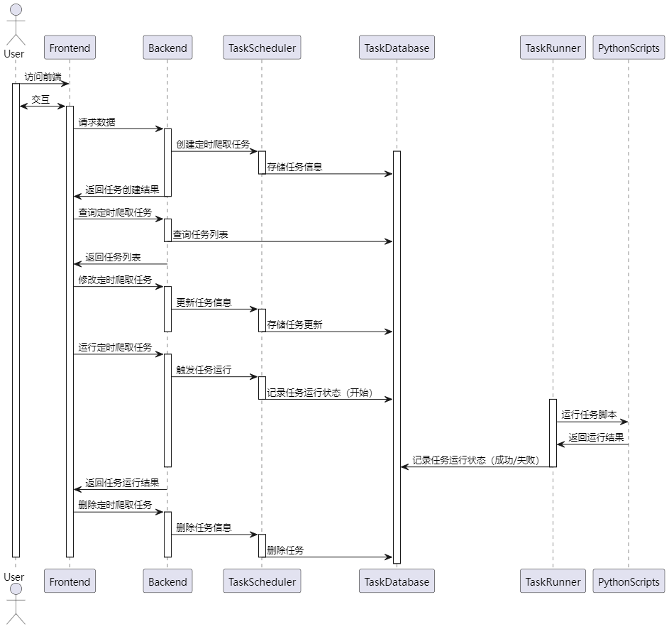

图4.5 爬取任务管理

#### 任务执行

通过taskService获取任务信息，设置任务的开始时间，通过scriptService获取与任务相关的脚本信息，创建一个Python进程，用于执行脚本，通过读取进程的标准输出，获取执行过程中的输出信息，逐行打印到控制台，同样，通过读取进程的错误输出，获取错误信息，逐行打印到控制台，并将错误信息存储在任务对象中，等待Python进程执行完成，阻塞方法，直到进程执行完毕。根据进程的退出码，判断任务执行是否成功，如果退出码为0，任务标记为成功；否则，标记为失败，设置任务的结束时间，使用taskService更新任务信息，时序图如图4.6所示。

图4.6 Java执行Python脚本

#### 数据爬取

本系统有多个数据爬取的Python脚本，主要爬取的方式有两种：第一种直接请求接口，获取接口返回的数据，然后存入DB中，第二种需要使用BeautifulSoup框架分析返回的页面，读取HTML与Class属性，获取其中的字段值，然后存入DB中。因此这里主要以书籍信息爬取（接口返回的数据为HTML页面），月票信息数据（接口直接返回的数据）为例，进行数据爬取设计。

主函数（Main）从数据库（DB）获取书籍的ID和描述。对于每本书籍，主函数创建一个线程并执行get_book_details函数（GetBookDetails）。get_book_details函数构建URL并发起HTTP请求（HTTPRequest）。HTTP请求的响应被接收并通过HTML解析器（HTMLParser）解析。解析后的数据返回给get_book_details函数。get_book_details函数将数据保存到数据库（DataSave），时序图如图4.7所示。

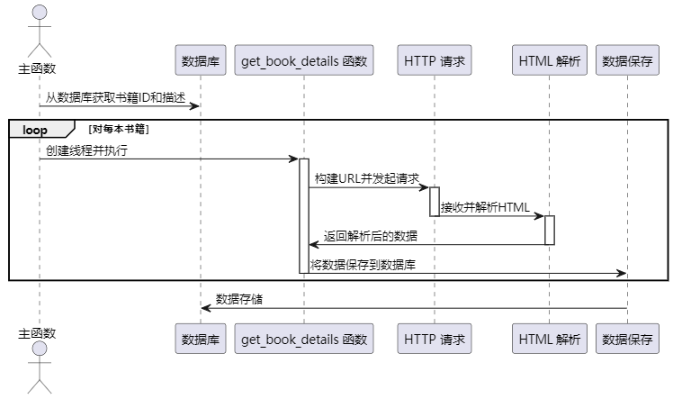

图4.7 书籍信息获取时序图

主函数（Main）获取当前的时间和年份。对每个月份，主函数创建一个线程来执行fetch_data函数。fetch_data函数发送带有查询参数的POST请求。接收到的HTTP响应数据被返回给fetch_data函数。fetch_data函数处理和格式化数据。处理后的数据被保存到数据库，时序图如图4.8所示。

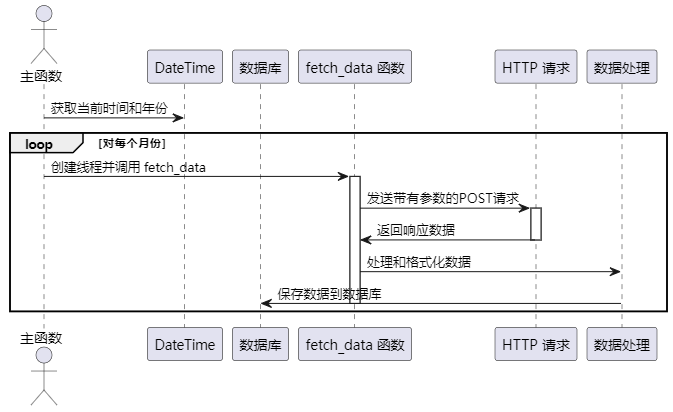

图4.8 月票数据获取

#### 数据分析

情感分析时序图如图4.9所示，Spark Session 初始化: 初始化 SparkSession 以连接Spark集群，从数据库读取数据: 使用Spark的JDBC接口读取数据库中的评论数据，数据过滤和选择: 基于 bookId 过滤评论，并选择需要的列（content, nickName, createTime, ipRegion），数据清洗: 对评论内容进行清洗，移除HTML标签，情感分析: 对清洗后的评论内容应用情感分析，使用了阿里云的NLP服务，让情感分析的结果更加精确，情感分析结果处理: 创建 SentimentRow 对象来存储分析结果，并加入结果列表，返回结果: 返回包含情感分析结果的数据集。

图4.9 情感分析时序图

书籍分析时序图如图4.10所示，客户端调用BookAnalysis方法，该方法首先创建一个含四个线程的线程池，然后异步提交四个任务到booksMapper，分别获取基于粉丝数、关键词数、推荐算法的Top图书数据以及所有Top图书的综合数据，每个任务返回一个Future对象。方法同步等待所有Future结果，处理这些数据，创建两种图表对象line和lines，在完成所有任务后关闭线程池，最终构建并返回一个包含所有分析数据的BookAnalysis对象给前端，前端在通过这些数据进行书籍分析可视化展示。

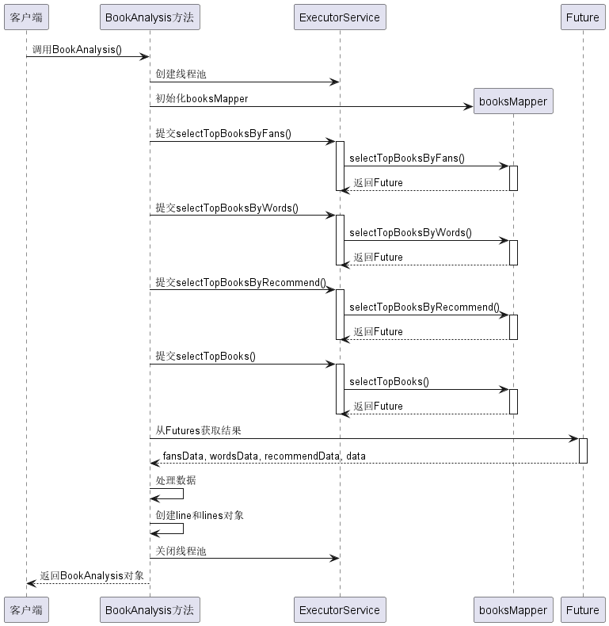

图4.10 书籍分析时序图

榜单分析时序图如图4.11所示 ，使用monthMapper.monthsLine(bookId)查询获取指定书籍的月份排名数据，结果映射到BookAnalysis.WordCloud对象的列表，提取月份名称和对应的排名值，使用monthMapper.clicksPie(bookId)查询根据天、周、月分类的点击数据，结果同样映射到BookAnalysis.WordCloud对象的列表。使用monthMapper.recommondsPie(bookId)查询根据天、周、月分类的推荐数据。结果也映射到BookAnalysis.WordCloud对象的列表，最后，方法创建一个BookAnalysis对象，其中包含月份排名线图（line），点击数据饼图（clicks），推荐数据饼图（recommonds），然后返回这个对象。

图4.11 榜单分析时序图

### 数据库设计

#### E-R图设计

根据上述章节设计得知，系统共包含8个主要实体：用户、任务、脚本、推荐、月票、评论、书籍和点击。这些实体构成了系统的数据层面，为系统的功能和数据管理提供了基础。

在系统中，脚本实体与任务实体之间存在一对多的关系。这意味着一个任务可以与一个脚本关联，而一个脚本可以同时被多个任务引用。这种关系设计使系统能够更有效地执行各种任务所需的脚本，提高系统的灵活性和可扩展性。

此外，系统中的书籍实体与月票、点击、评论和推荐数据相关联。这表示一个书籍可以对应多个月票、点击、评论和推荐数据。系统可以根据这些数据来查询和分析特定书籍的信息，从而实现不同维度的数据分析和洞察，系统的数据库E-R图如图4.12所示。

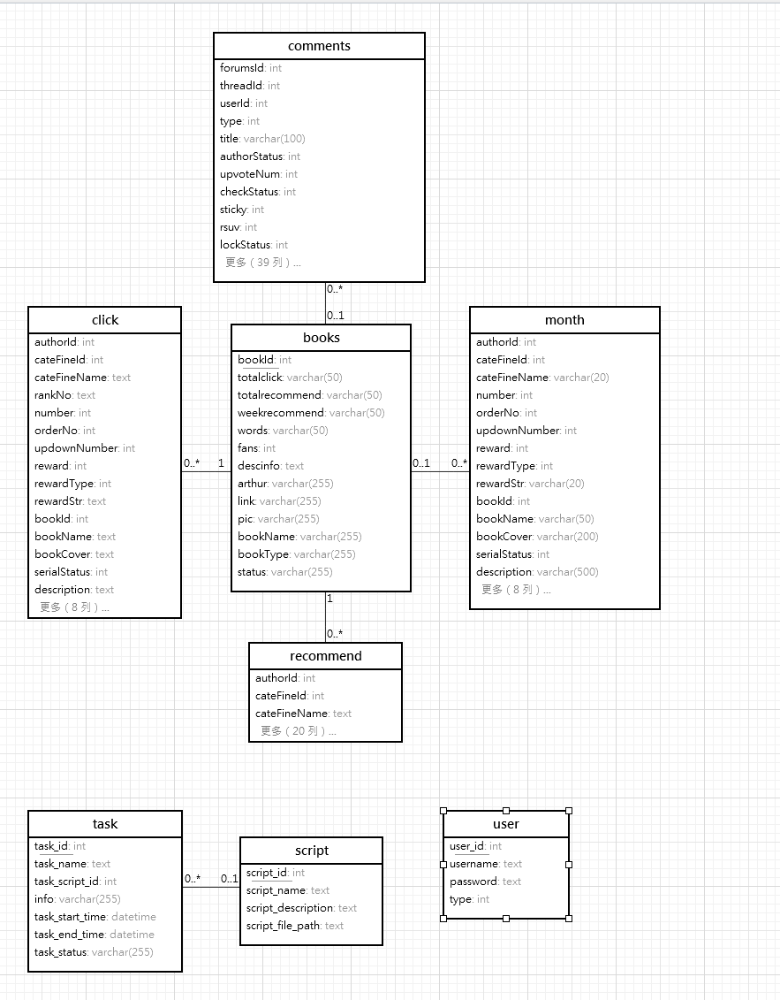

图4.12 数据库E-R实体关系图

#### 数据库表设计

通过4.2章节功能设计得知，本系统共有8张表，用户表存储账号密码数据，实现用户登录功能；任务表存储Python脚本数据，实现数据爬取，数据分析等功能；脚本表存储Python脚本，方便Java调用Python脚本；书籍表存储该书籍的总点击数，总字数等；点击表存储着年，月，日的点击数据；评论表存储着所有来自纵横中文网的评论数据；月票表存储着来自纵横中文网的月票榜单数据；推荐表存储着纵横中文网每周，每天，每月的推荐数据，系统通过这些表中的数据实现情感分析，书籍分析等功能。

用户表结构如表4.1所示，用户表主要字段为username与password，该字段存储着用户的登录账号与密码，方便系统服务端对用户输入的数据进行判断，来验证该用户是否为系统用户。

表4.1 用户表

<table>
<tr><td>字段名</td><td>数据类型</td><td>主键/允许空</td><td>字段含义</td></tr>
<tr><td>user_id</td><td>int</td><td>PRIMARY KEY</td><td>用户表主键</td></tr>
<tr><td>username</td><td>varchar</td><td>不允许</td><td>登录账号</td></tr>
<tr><td>password</td><td>varchar</td><td>不允许</td><td>登录密码</td></tr>
</table>

任务表结构如表4.2所示，任务表主要存储着本系统所有数据爬取或者数据分析任务，主要字段为task_script_id，该字段关联脚本表，系统通过该字段获取脚本位置，以此来运行Python脚本。

表4.2 任务表

<table>
<tr><td>字段名</td><td>数据类型</td><td>主键/允许空</td><td>字段含义</td></tr>
<tr><td>info</td><td>varchar(255)</td><td>NULL</td><td>执行信息</td></tr>
<tr><td>task_end_time</td><td>datetime</td><td>NULL</td><td>结束时间</td></tr>
<tr><td>task_id</td><td>int</td><td>PRIMARY KEY</td><td>主键</td></tr>
<tr><td>task_name</td><td>text</td><td>NULL</td><td>任务名称</td></tr>
<tr><td>task_script_id</td><td>int</td><td>NULL</td><td>脚本信息</td></tr>
<tr><td>task_start_time</td><td>datetime</td><td>NULL</td><td>开始时间</td></tr>
<tr><td>task_status</td><td>varchar(255)</td><td>NULL</td><td>状态</td></tr>
</table>

脚本表结构如表4.3所示，脚本表主要存储着本系统所有Python脚本数据信息，重要字段为script_file_path表示脚本在系统中的路径。

表4.3 脚本表

<table>
<tr><td>字段名</td><td>数据类型</td><td>主键/允许空</td><td>字段含义</td></tr>
<tr><td>script_description</td><td>text</td><td>NULL</td><td>脚本解释</td></tr>
<tr><td>script_file_path</td><td>text</td><td>NULL</td><td>脚本实际位置</td></tr>
<tr><td>script_id</td><td>int</td><td>PRIMARY KEY</td><td>脚本id</td></tr>
<tr><td>script_name</td><td>text</td><td>NULL</td><td>脚本名称</td></tr>
</table>

推荐表如表4.4所示，存储着所有来自纵横中文网的书籍推荐数据，其中type字段表示了数据的来自区间（天推荐，周推荐，月推荐），isPython是系统生成的唯一字段也是主键，bookId关联了书籍表。

表4.4 推荐表

<table>
<tr><td>字段名</td><td>数据类型</td><td>主键/允许空</td><td>字段含义</td></tr>
<tr><td>authorCover</td><td>text</td><td>NULL</td><td>作者的头像，字符串类型，可为空</td></tr>
<tr><td>authorId</td><td>int</td><td>NOT NULL</td><td>作者的id，整数类型，主键，不可为空</td></tr>
<tr><td>bookCover</td><td>text</td><td>NOT NULL</td><td>书籍的封面，字符串类型，不可为空</td></tr>
<tr><td>bookId</td><td>int</td><td>NOT NULL</td><td>书籍的id，整数类型，主键，不可为空</td></tr>
<tr><td>bookName</td><td>text</td><td>NOT NULL</td><td>书籍的名称，字符串类型，不可为空</td></tr>
<tr><td>cateFineId</td><td>int</td><td>NOT NULL</td><td>书籍的细分类别的id，整数类型，不可为空</td></tr>
<tr><td>cateFineName</td><td>text</td><td>NOT NULL</td><td>书籍的细分类别的名称，字符串类型，不可为空</td></tr>
<tr><td>description</td><td>text</td><td>NOT NULL</td><td>书籍的简介，字符串类型，不可为空</td></tr>
<tr><td>isFavorite</td><td>tinyint(1)</td><td>NOT NULL</td><td>书籍是否被收藏，布尔类型，不可为空</td></tr>
<tr><td>isPython</td><td>varchar(50)</td><td>PRIMARY KEY</td><td>唯一标识</td></tr>
<tr><td>latestChapterId</td><td>int</td><td>NOT NULL</td><td>书籍的最新章节id，整数类型，不可为空</td></tr>
<tr><td>latestChapterName</td><td>text</td><td>NOT NULL</td><td>书籍的最新章节名称，字符串类型，不可为空</td></tr>
<tr><td>latestChapterTime</td><td>text</td><td>NOT NULL</td><td>书籍的最新章节更新时间，字符串类型，不可为空</td></tr>
<tr><td>number</td><td>int</td><td>NOT NULL</td><td>书籍的阅读量，整数类型，不可为空</td></tr>
<tr><td>orderNo</td><td>int</td><td>NOT NULL</td><td>书籍的排序号，整数类型，不可为空</td></tr>
<tr><td>pseudonym</td><td>text</td><td>NOT NULL</td><td>作者的笔名，字符串类型，不可为空</td></tr>
<tr><td>rankNo</td><td>text</td><td>NULL</td><td>书籍的排名，字符串类型，可为空</td></tr>
<tr><td>reward</td><td>int</td><td>NOT NULL</td><td>书籍的打赏金额，整数类型，不可为空</td></tr>
<tr><td>rewardStr</td><td>text</td><td>NULL</td><td>书籍的打赏字符串，字符串类型，可为空</td></tr>
<tr><td>rewardType</td><td>int</td><td>NOT NULL</td><td>书籍的打赏类型，整数类型，不可为空</td></tr>
<tr><td>serialStatus</td><td>int</td><td>NOT NULL</td><td>书籍的连载状态，整数类型，不可为空</td></tr>
<tr><td>type</td><td>int</td><td>NOT NULL</td><td>0天1周2月</td></tr>
<tr><td>updownNumber</td><td>int</td><td>NOT NULL</td><td>书籍的上下架状态，整数类型，不可为空</td></tr>
</table>

月票表结构如表4.5所示，存储着所有纵横中文网的月票数据，系统可以根据这些数据进行书籍分析，读者爱好分析等，bookId字段关联了书籍表。

表4.5 月票表

<table>
<tr><td>字段名</td><td>数据类型</td><td>主键/允许空</td><td>字段含义</td></tr>
<tr><td>authorCover</td><td>varchar(200)</td><td>NULL</td><td>作者的头像图片地址</td></tr>
<tr><td>authorId</td><td>int</td><td>NULL</td><td>作者的 ID</td></tr>
<tr><td>bookCover</td><td>varchar(200)</td><td>NULL</td><td>书籍的封面图片地址</td></tr>
<tr><td>bookId</td><td>int</td><td>NULL</td><td>书籍的 ID</td></tr>
<tr><td>bookName</td><td>varchar(50)</td><td>NULL</td><td>书籍的名称</td></tr>
<tr><td>cateFineId</td><td>int</td><td>NULL</td><td>书籍的细分类别 ID</td></tr>
<tr><td>cateFineName</td><td>varchar(20)</td><td>NULL</td><td>书籍的细分类别名称</td></tr>
<tr><td>description</td><td>varchar(500)</td><td>NULL</td><td>书籍的简介</td></tr>
<tr><td>is_python</td><td>varchar(20)</td><td>PRIMARY KEY</td><td>书籍的爬虫标识</td></tr>
<tr><td>isFavorite</td><td>tinyint(1)</td><td>NULL</td><td>书籍是否被收藏</td></tr>
<tr><td>latestChapterId</td><td>int</td><td>NULL</td><td>书籍的最新章节 ID</td></tr>
<tr><td>latestChapterName</td><td>varchar(50)</td><td>NULL</td><td>书籍的最新章节名称</td></tr>
<tr><td>latestChapterTime</td><td>varchar(20)</td><td>NULL</td><td>书籍的最新章节更新时间</td></tr>
<tr><td>number</td><td>int</td><td>NULL</td><td>月票数</td></tr>
<tr><td>orderNo</td><td>int</td><td>NULL</td><td>排序</td></tr>
<tr><td>pseudonym</td><td>varchar(20)</td><td>NULL</td><td>作者的笔名</td></tr>
<tr><td>rankNo</td><td>varchar(20)</td><td>NOT NULL</td><td>爬取的月票年份与月份</td></tr>
<tr><td>reward</td><td>int</td><td>NULL</td><td>奖励</td></tr>
<tr><td>rewardStr</td><td>varchar(20)</td><td>NULL</td><td>奖励说明</td></tr>
<tr><td>rewardType</td><td>int</td><td>NULL</td><td>奖励类型</td></tr>
<tr><td>serialStatus</td><td>int</td><td>NULL</td><td>书籍的连载状态</td></tr>
<tr><td>updownNumber</td><td>int</td><td>NULL</td><td>书籍的上下架状态</td></tr>
</table>

评论表如表4.6所示，里面存储着所有评论数据，系统可以根据这些数据，进行地域分析，书籍评论情感分析，帮助用户掌握读者心理走向。

表4.6 评论表

<table>
<tr><td>字段名</td><td>数据类型</td><td>主键/允许空</td><td>字段含义</td></tr>
<tr><td>authorStatus</td><td>int</td><td>NOT NULL1</td><td>作者的状态</td></tr>
<tr><td>beRefPost</td><td>varchar(500)</td><td>NULL</td><td>评论的被引用评论</td></tr>
<tr><td>beRepliedNickName</td><td>varchar(20)</td><td>NULL</td><td>评论的被回复用户昵称</td></tr>
<tr><td>beRepliedUserId</td><td>int</td><td>NOT NULL</td><td>评论的被回复用户ID</td></tr>
<tr><td>bookId</td><td>int</td><td>NULL</td><td>评论的书籍</td></tr>
<tr><td>checkStatus</td><td>int</td><td>NOT NULL</td><td>评论的审核状态</td></tr>
<tr><td>content</td><td>text</td><td>NOT NULL</td><td>评论的内容</td></tr>
<tr><td>contentType</td><td>int</td><td>NOT NULL</td><td>评论的内容类型</td></tr>
<tr><td>createTime</td><td>bigint</td><td>NOT NULL</td><td>评论的创建时间</td></tr>
<tr><td>donateUnit</td><td>int</td><td>NOT NULL</td><td>评论的打赏单位</td></tr>
<tr><td>fansScoreLevel</td><td>int</td><td>NOT NULL</td><td>用户的粉丝评分等级</td></tr>
<tr><td>forumLeaderStatus</td><td>int</td><td>NOT NULL</td><td>用户的论坛领导者状态</td></tr>
<tr><td>forumsId</td><td>int</td><td>NOT NULL</td><td>论坛的ID</td></tr>
<tr><td>heatIgnore</td><td>int</td><td>NOT NULL</td><td>评论的热度忽略</td></tr>
<tr><td>heatNumber</td><td>int</td><td>NOT NULL</td><td>评论的热度数</td></tr>
<tr><td>heatNumMark</td><td>bigint</td><td>NOT NULL</td><td>评论的热度标记</td></tr>
<tr><td>imageUrl</td><td>text</td><td>NULL</td><td>评论的图片地址</td></tr>
<tr><td>includeThreadList</td><td>varchar(200)</td><td>NULL</td><td>评论的包含帖子列表</td></tr>
<tr><td>ipRegion</td><td>varchar(20)</td><td>NOT NULL</td><td>用户的IP地区</td></tr>
<tr><td>isClickSupport</td><td>int</td><td>NOT NULL</td><td>用户是否点击支持</td></tr>
<tr><td>lastPostTime</td><td>bigint</td><td>NOT NULL</td><td>评论的最后回复时间</td></tr>
<tr><td>lockStatus</td><td>int</td><td>NOT NULL</td><td>评论的锁定状态</td></tr>
<tr><td>markRed</td><td>tinyint(1)</td><td>NOT NULL</td><td>评论是否标红</td></tr>
<tr><td>mentionedNickNames</td><td>varchar(200)</td><td>NULL</td><td>评论的提及用户昵称</td></tr>
<tr><td>mentionedUsers</td><td>varchar(200)</td><td>NULL</td><td>评论的提及用户</td></tr>
<tr><td>nickName</td><td>varchar(20)</td><td>NOT NULL</td><td>用户的昵称</td></tr>
<tr><td>opStatus</td><td>int</td><td>NOT NULL</td><td>评论的操作状态</td></tr>
<tr><td>orderNum</td><td>int</td><td>NOT NULL</td><td>评论的排序号</td></tr>
<tr><td>postNum</td><td>int</td><td>NOT NULL</td><td>评论的回复数</td></tr>
<tr><td>redPacketId</td><td>int</td><td>NOT NULL</td><td>评论的红包ID</td></tr>
<tr><td>refChapterContent</td><td>varchar(500)</td><td>NULL</td><td>评论的引用章节内容</td></tr>
<tr><td>refChapterName</td><td>varchar(50)</td><td>NULL</td><td>评论的引用章节名称</td></tr>
<tr><td>refPostId</td><td>int</td><td>NOT NULL</td><td>评论的引用评论ID</td></tr>
<tr><td>refThreadId</td><td>int</td><td>NOT NULL</td><td>评论的引用帖子ID</td></tr>
<tr><td>replyPostParentId</td><td>int</td><td>NOT NULL</td><td>评论的回复父评论ID</td></tr>
<tr><td>rpList</td><td>varchar(500)</td><td>NULL</td><td>评论的回复列表</td></tr>
<tr><td>rsuv</td><td>int</td><td>NOT NULL</td><td>评论的rsuv值</td></tr>
<tr><td>scoreLevelNickName</td><td>varchar(20)</td><td>NOT NULL</td><td>用户的评分等级昵称</td></tr>
<tr><td>speakForbid</td><td>tinyint(1)</td><td>NOT NULL</td><td>用户是否被禁言</td></tr>
<tr><td>sticky</td><td>int</td><td>NOT NULL</td><td>评论是否置顶</td></tr>
<tr><td>threadDonateType</td><td>int</td><td>NOT NULL</td><td>评论的帖子打赏类型</td></tr>
<tr><td>threadId</td><td>int</td><td>NOT NULL</td><td>帖子的ID</td></tr>
<tr><td>title</td><td>varchar(100)</td><td>NULL</td><td>评论的标题</td></tr>
<tr><td>trendIds</td><td>varchar(200)</td><td>NULL</td><td>评论的趋势ID</td></tr>
<tr><td>trendViews</td><td>varchar(500)</td><td>NULL</td><td>评论的趋势视图</td></tr>
<tr><td>type</td><td>int</td><td>NOT NULL</td><td>评论的类型</td></tr>
<tr><td>upvoteNum</td><td>int</td><td>NOT NULL</td><td>评论的点赞数</td></tr>
<tr><td>userId</td><td>int</td><td>NOT NULL</td><td>用户的ID</td></tr>
<tr><td>userImgUrl</td><td>varchar(200)</td><td>NOT NULL</td><td>用户的头像地址</td></tr>
<tr><td>userLevel</td><td>int</td><td>NOT NULL</td><td>用户的等级</td></tr>
</table>

点击表如表4.7所示，点击表存储收集纵横中文网的点击数据，这些数据可以帮助分析用户的读书爱好等。

表4.7 点击表

<table>
<tr><td>字段名</td><td>数据类型</td><td>主键/允许空</td><td>字段含义</td></tr>
<tr><td>authorCover</td><td>text</td><td>NULL</td><td>作者的头像，字符串类型，可为空</td></tr>
<tr><td>authorId</td><td>int</td><td>NOT NULL</td><td>作者的id，整数类型，不可为空</td></tr>
<tr><td>bookCover</td><td>text</td><td>NOT NULL</td><td>书籍的封面，字符串类型，不可为空</td></tr>
<tr><td>bookId</td><td>int</td><td>NOT NULL</td><td>书籍的id，整数类型，主键，不可为空</td></tr>
<tr><td>bookName</td><td>text</td><td>NOT NULL</td><td>书籍的名称，字符串类型，不可为空</td></tr>
<tr><td>cateFineId</td><td>int</td><td>NOT NULL</td><td>书籍的细分类别的id，整数类型，不可为空</td></tr>
<tr><td>cateFineName</td><td>text</td><td>NOT NULL</td><td>书籍的细分类别的名称，字符串类型</td></tr>
<tr><td>description</td><td>text</td><td>NOT NULL</td><td>书籍的简介，字符串类型，不可为空</td></tr>
<tr><td>isFavorite</td><td>tinyint(1)</td><td>NOT NULL</td><td>书籍是否被收藏，布尔类型，不可为空</td></tr>
<tr><td>isPython</td><td>varchar(50)</td><td>PRIMARY KEY</td><td>书籍的爬取标识</td></tr>
<tr><td>latestChapterId</td><td>int</td><td>NOT NULL</td><td>书籍的最新章节id，整数类型，不可为空</td></tr>
<tr><td>latestChapterName</td><td>text</td><td>NOT NULL</td><td>书籍的最新章节名称，字符串类型，不可为空</td></tr>
<tr><td>latestChapterTime</td><td>text</td><td>NOT NULL</td><td>书籍的最新章节更新时间，字符串类型，不可为空</td></tr>
<tr><td>number</td><td>int</td><td>NOT NULL</td><td>排名的数量</td></tr>
<tr><td>orderNo</td><td>int</td><td>NOT NULL</td><td>书籍的排序号，整数类型，不可为空</td></tr>
<tr><td>pseudonym</td><td>text</td><td>NOT NULL</td><td>作者的笔名，字符串类型，不可为空</td></tr>
<tr><td>rankNo</td><td>text</td><td>NULL</td><td>书籍的排名，字符串类型，可为空</td></tr>
<tr><td>reward</td><td>int</td><td>NOT NULL</td><td>书籍的打赏金额，整数类型，不可为空</td></tr>
<tr><td>rewardStr</td><td>text</td><td>NULL</td><td>书籍的打赏字符串，字符串类型，可为空</td></tr>
<tr><td>rewardType</td><td>int</td><td>NOT NULL</td><td>书籍的打赏类型，整数类型，不可为空</td></tr>
<tr><td>serialStatus</td><td>int</td><td>NOT NULL</td><td>书籍的连载状态，整数类型，不可为空</td></tr>
<tr><td>type</td><td>int</td><td>NOT NULL</td><td>0天1周2月</td></tr>
<tr><td>updownNumber</td><td>int</td><td>NOT NULL</td><td>书籍的上下架状态，整数类型，不可为空</td></tr>
</table>

书籍表如表4.8所示，书籍表主要存储着书籍的基本信息，并且与点击表，评论表，月票表，推荐表有一对多的关联关系。

表4.8 书籍表

<table>
<tr><td>字段名</td><td>数据类型</td><td>主键/允许空</td><td>字段含义</td></tr>
<tr><td>arthur</td><td>varchar(255)</td><td>NOT NULL</td><td>作者</td></tr>
<tr><td>bookId</td><td>int</td><td>PRIMARY KEY</td><td>书籍id唯一</td></tr>
<tr><td>bookName</td><td>varchar(255)</td><td>NOT NULL</td><td>作品名称</td></tr>
<tr><td>bookType</td><td>varchar(255)</td><td>NOT NULL</td><td>作品类型</td></tr>
<tr><td>descinfo</td><td>text</td><td>NOT NULL</td><td>作品介绍</td></tr>
<tr><td>fans</td><td>int</td><td>NOT NULL</td><td>总粉丝数</td></tr>
<tr><td>link</td><td>varchar(255)</td><td>NOT NULL</td><td>地址</td></tr>
<tr><td>pic</td><td>varchar(255)</td><td>NOT NULL</td><td>作品封面</td></tr>
<tr><td>status</td><td>varchar(255)</td><td>NOT NULL</td><td>状态</td></tr>
<tr><td>totalclick</td><td>varchar(50)</td><td>NOT NULL</td><td>总点击数</td></tr>
<tr><td>totalrecommend</td><td>varchar(50)</td><td>NOT NULL</td><td>总推荐数</td></tr>
<tr><td>weekrecommend</td><td>varchar(50)</td><td>NOT NULL</td><td>周推荐</td></tr>
<tr><td>words</td><td>varchar(50)</td><td>NOT NULL</td><td>总字数</td></tr>
</table>

## 系统实现

### 登录实现

登录界面如图5.1所示，界面整体为Form表单，使用el-form组件构造，然后使用el-input组件构造表单的input输入框，并使用v-model进行值得双向绑定，当用户点击登录按钮，前端触发事件submitForm，进行服务端接口back/login请求，在服务端中通过userService的getOne方法，进行数据库的登录账号与密码的查询，在查询前使用getMD5静态方法对密码进行加密处理，调用静态方法sign，生成JWT，通过构造函数，组成一个新的登录结果对象UserLoginDto，并将该对象返回给前端，如果过程有异常出现，系统将通过@RestControllerAdvice与@ ExceptionHandler注解进行异常的切面拦截，然后组装好异常并返回给前端。

图5.1 系统登录界面

### 脚本管理

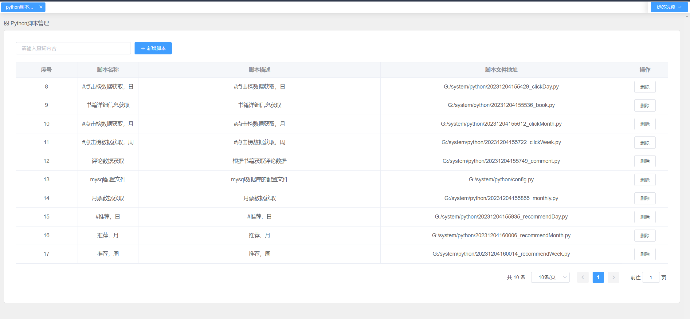

图5.2 脚本列表

脚本列表界面如图5.2所示，当后台用户登录成功后，前端请求服务端接口：/back/scriptList，并传入分页查询参数：likeString，pageIndex，pageSize，服务端构造QueryWrapper查询条件，然后通过scriptService的page函数进行分页查询，前端收到结果使用el-table组件对列表内容进行渲染展示。

添加界面如图5.3所示，当用户点击添加按钮后，系统弹出Form表单，表单由输入框与文件上传组成，文件上传使用了el-upload组件，并且定义了新的HTTP请求:http-request="fileUpload"，让其可以进行登录校验，用户选择文件后，对服务端接口back/upload发起请求，将数据文件上传到指定位置，并返回文件地址，然后用户点击提交，将脚本存入数据库中。

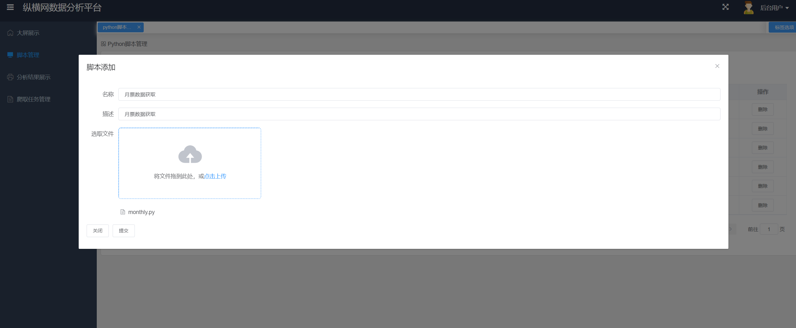

图5.3 脚本增加

### 爬取任务管理

爬取任务列表界面如图5.4所示，列表整体为Table，前端用户进入爬取任务管理模块后，请求服务端接口/api/back/taskList，并传入分页参数与名字模糊查询查询，服务端通过Select 语句对数据库执行查询操作，并将查询的结果分页，使用了Limit，然后通过Response返回给前端，前端通过Vue的双向绑定，绑定数据，然后渲染出表格内容。

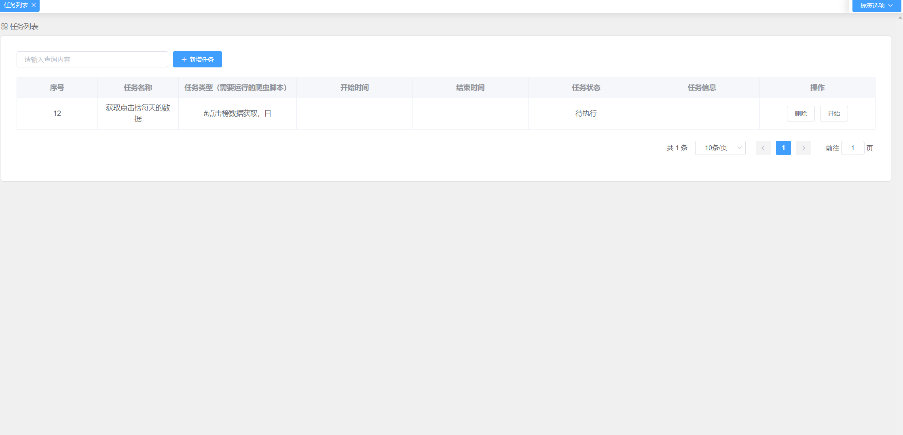

图5.4 任务列表

任务添加界面如图5.5所示，用户可以选择任务的执行脚本，然后点击添加，系统通过Axios请求服务端的任务添加接口：saveTask，服务端自动未改任务的状态赋值为：待执行，然后执行Save接口，将数据保存进数据库中。

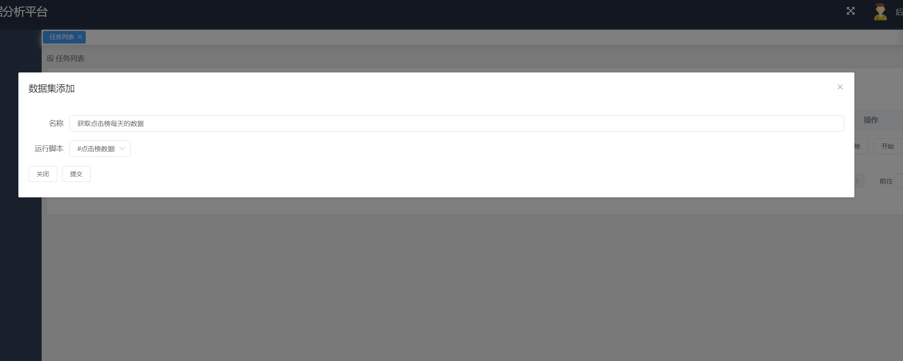

图5.5 任务添加

用户点击开始按钮，访问服务端接口back/start，服务端通过任务主键，获取任务西信息，然后获取任务的脚本信息，使用ProcessBuilder用于指定要执行的Python脚本路径，并使用Runtime.getRuntime().exec方法启动新进程。然后，我们使用BufferedReader和InputStreamReader读取进程的输出，并使用waitFor()方法等待进程完成执行，并对waitFor的结果进行判断，如果不为0表示执行失败，脚本有问题，如果为0，表示执行成功，结果如图5.6所示。

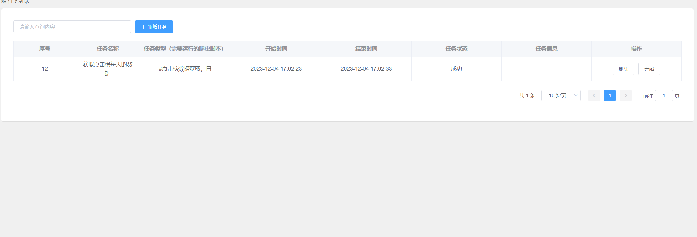

图5.6 任务执行

系统还有部分定时任务，定时任务使用了Scheduled注解，然后在注解中，使用了Corn表达式，来每天，每周，每月中午12点，自动执行脚本去获取数据，调用脚本执行方法Start。

### 数据获取

本系统数据获取脚本共有9个，分别获取点击日，周，月；推荐日，周，月；月票榜单；书籍信息，评论信息数据，这里主要介绍评论信息数据的实现过程，首先配置数据库连接与配置：代码开始处导入了必要的模块，并从config.py中导入数据库配置（db_config和engine）。然后获取书籍ID：get_bookids()函数从数据库的books表中查询所有的书籍ID。使用SQLAlchemy库来反射数据库表并执行查询。获取评论数据：get_comment_data()函数根据书籍ID构造请求URL，发送请求到指定的网址，然后解析返回的JSON数据，提取出评论内容、作者、时间等信息，并将这些信息存储在字典中。保存评论数据：save_comment_data()函数将从网站上获取的评论数据保存到数据库的comments表中。多线程爬取：程序使用ThreadPoolExecutor来创建一个线程池，通过main()函数并行执行worker()函数。worker()函数负责调用get_comment_data()和save_comment_data()函数来爬取和保存数据。错误处理和日志记录：在save_comment_data()函数中，代码通过try-except块处理了可能的数据库插入错误，并在成功或失败时打印相应的日志信息。剩下脚本的实现方式与其一致，不同的是书籍详细信息返回的内容为HTML文档，这里使用了BeautifulSoup进行数据的提取，主要提取了书籍名称，作者，书籍总票数，总字数，分类等信息，数据获取脚本执行情况如图5.7所示。

图5.7 数据脚本执行情况

### 数据结果列表展示

点击榜数据展示结果如图5.8所示，页面整体为饿了么UI的Table组件，然后引入了分页组件el-pagination，然后在data中定义列表数据对象monthDataList，在created生命周期定义数据请求方法getList，通过Axios请求列表请求接口：clickList，传入查询参数，在接口中首先初始化了一个查询包装器，用于构建数据库查询，然后对请求参数进行条件判断，if (!searchVto.getLikeString().isEmpty())：如果搜索字符串不为空，则在bookName、pseudonym、cateFineName字段上应用 LIKE 查询。if(!searchVto.getIsPython().isEmpty())：如果isPython字段不为空，则对该字段应用等于（eq）条件。if(!searchVto.getType().isEmpty())：如果type字段不为空，则对该字段应用等于（eq）条件。if(searchVto.getOrderBy().equals("1"))：如果orderBy字段为 "1"，则根据number和rankNo字段降序排序。否则，根据number升序和rankNo降序排序，最后使用服务层的page方法执行分页查询。它创建了一个新的Page<Click>对象，其中包含了分页参数（如页码和页面大小），并使用之前构建的queryWrapper作为查询条件，将结果返回给前端，前端通过双向绑定进行值得绑定，渲染结果，剩下模块得数据结果展示方式与其一致，只是在接口中使用MyBatis-Plus对不同得表进行Select查询。

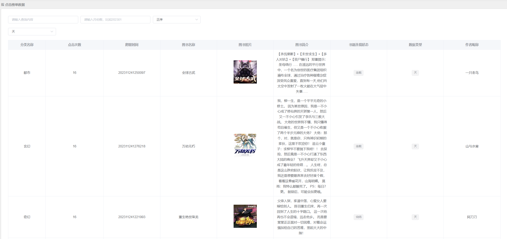

图5.8 点击榜数据

### 数据分析

#### 评论情感分析

图5.9 书籍评论情感分析界面

情感分析实现界面如图5.9所示，界面总共由4块组成，第一块为书籍的下拉选择框，第二个为该书籍评论书籍的汇总，第三块为评论词云图与正负面评论环形图，最后为正面与负面评论的table表格，当用户进入次页面后，系统首先通过Axios请求服务端接口books/，该请求为POST请求，传入Python脚本爬取的书籍id，然后在接口中，首先初始化一个Spark会话，从数据库中读取评论数据，根据书籍ID（前端传递而来的参数）过滤评论，清洗数据，去除评论中的HTML标签，并去除重复的评论，对每条评论进行情感分析-使用阿里云的NPLAPI，将结果收集为一个列表，并返回这个列表，然后前端使用echarts模块的pie与wordCloud进行可视化图像的制作。用户可以通过次功能，实时掌握用户对该书籍的情绪走向，也可以帮助作者掌握情绪走向，进行更好的情绪或者舆论引导。

#### 书籍分析

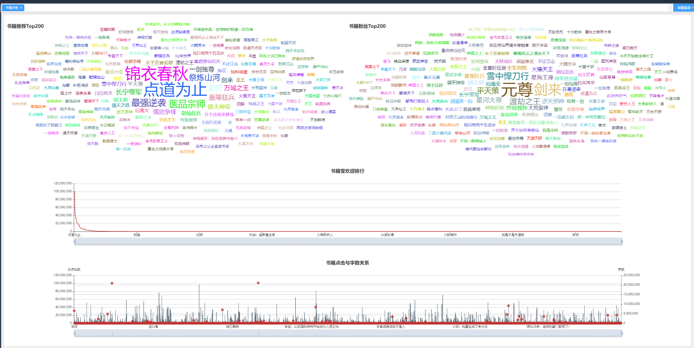

图5.10 书籍分析界面

书籍分析界面如图5.10所示，首先前端请求服务端接口books/，在服务端中首先创建一个含有4个线程的线程池，通过线程池提交了四个异步任务，每个任务调用booksMapper的不同方法来获取数据：selectTopBooksByFans()：获取基于粉丝数的Top图书；selectTopBooksByWords()：获取基于关键词数的Top图书；selectTopBooksByRecommend()：获取基于推荐算法的Top图书；selectTopBooks()：获取所有Top图书。这些任务被封装在Future对象中，以便异步执行.等待任务完成并获取结果：使用Future.get()方法等待每个任务的完成，并获取返回的结果。这一步会阻塞直到相应的任务完成。处理数据：提取所有Top图书的名称、值和点击数。提取推荐算法推荐的图书名称和值,构建数据对象：创建line对象，包含推荐算法推荐的图书名称和值。创建lines对象，包含所有Top图书的名称、值和点击数。关闭线程池：执行完所有任务后，关闭线程池以释放资源，最后返回数据给前端，前端通过服务端的数据访问initChart方法，在该方法中，前端依次对词云图，柱状图，散点图进行初始化，完成数据的可视化，分别展示最受欢迎的书籍，粉丝数最大的书籍，书籍点击与字数间的联系，来帮助用户与作者进行书籍质量的把握，通过这些数据的分析，让作者创造出更好的著作。

#### 榜单分析

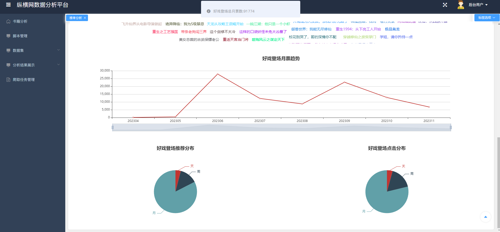

图5.11 榜单分析界面

榜单分析界面如图5.11所示，首先顶部是由词云图组成的月票榜单前500名书籍，词云图的占比大小由月票总数组成，可以直观的向用户展示最赚钱，最吸金的小说，然后用户点击词云图中的某一个词，系统请求接口/months/{bookId}，传入bookId，服务端通过BookId获取该书籍对应的月票走势信息，点击榜与推荐榜的日，周，月总数信息，然后返回给前端，前端使用Echarts将数据进行可视化展示，直观显示月票与点击和推荐数据有着非常紧密的联系。

## 系统测试

### 测试环境与方法

本系统拟采用黑盒测试的方法，通过测试来检测每个功能是否都能正常使用。在测试中，把程序看作一个不能打开的黑盒子，在完全不考虑程序内部结构和内部特性的情况下，在程序接口进行测试，它只检查程序功能是否按照需求规格说明书的规定正常使用，程序是否能适当地接收输入数据而产生正确的输出信息。

系统在开发环境下进行测试：

操作系统：Windows11；

开发语言版本：Python3.7;JDK 1.8；MySQL 8.0.19;SparkSQL3.1.2,Node 15.6；

编译器：WebStorm，IDEA，Pycharm。

### 测试用例

系统登录测试，主要测试系统服务端是否正常对密码进行签名，是否可以正常拦截错误的账号与密码，登录成功UI是否自动跳转界面到首页，且服务端是否生成JWT，然后UI其他页面是否判断了当前操作用户是否进行了登录，测试用例如表6.1所示。

表6.1 登录测试用例表

<table>
<tr><td>名称</td><td colspan="3">登录测试用例</td></tr>
<tr><td>概述</td><td colspan="3">测试账号与密码验证逻辑是否与设计一致 测试登录成功，接口是否返回了JWT，UI是否跳转也页面 未登录的用户进入首页UI是否进行了限制，接口是否进行了限制 系统提前存入用户：admin，123456</td></tr>
<tr><td>步骤</td><td>步骤</td><td colspan="2">步骤与预期结果</td></tr>
<tr><td></td><td>1</td><td colspan="2">未登录的用户，浏览器输入系统首页</td></tr>
<tr><td></td><td>2</td><td colspan="2">登录界面输入账号admin，密码12345</td></tr>
<tr><td></td><td>3</td><td colspan="2">登录界面输入账号admin，密码123456</td></tr>
<tr><td colspan="4">测试结果</td></tr>
<tr><td>结果</td><td>1a</td><td>用户未登录，UI跳转登录界面，接口被拦截</td><td>通过</td></tr>
<tr><td></td><td>2a</td><td>登录界面提示账号与密码错误</td><td>通过</td></tr>
<tr><td></td><td>3a</td><td>提示登录成功，UI跳转首页，接口返回了生成的JWT</td><td>通过</td></tr>
</table>

脚本管理与爬取任务是系统数据获取的主要手段，这块的测试主要保证数据获取的稳定，测试用例如表6.2所示。

表6.2 脚本管理与爬取任务管理

<table>
<tr><td>名称</td><td colspan="3">脚本管理与爬取任务管理</td></tr>
<tr><td>概述</td><td colspan="3">测试脚本的增加，删除，查询 测试爬取任务的创建 测试爬取任务的列表查询，删除 测试爬取任务的手动执行与自动执行 测试爬取任务执行后，结果的查看是否正常</td></tr>
<tr><td>步骤</td><td>步骤</td><td colspan="2">步骤与预期结果</td></tr>
<tr><td></td><td>1</td><td colspan="2">登录进入系统，上传Python脚本：爬取</td></tr>
<tr><td></td><td>2</td><td colspan="2">在脚本管理中，对脚本进行搜索，并删除步骤1创建的脚本</td></tr>
<tr><td></td><td>3</td><td colspan="2">进入爬取任务管理，创建新的爬取任务：任务，选择脚本（脚本已经测试通过）</td></tr>
<tr><td></td><td>4</td><td colspan="2">进入爬取任务管理，进行查询，并删除任一一个任务</td></tr>
<tr><td></td><td>5</td><td colspan="2">手动执行步骤3创建的任务，然后等待系统自动执行任务</td></tr>
<tr><td></td><td>6</td><td colspan="2">查看“任务”的执行结果</td></tr>
<tr><td colspan="4">测试结果</td></tr>
<tr><td>结果</td><td>1a</td><td>爬取脚本上传成功</td><td>通过</td></tr>
<tr><td></td><td>2a</td><td>在脚本管理中的列表界面，输入爬取，查询成功，且是分页查询，然后删除脚本爬取，删除成功</td><td>通过</td></tr>
<tr><td></td><td>3a</td><td>创建爬取任务：“任务”成功</td><td>通过</td></tr>
<tr><td></td><td>4a</td><td>查询成功，并能删除其他任务</td><td>通过</td></tr>
<tr><td></td><td>5a</td><td>任务手动与自动执行成功，UI与系统没有报错</td><td>通过</td></tr>
<tr><td></td><td>6a</td><td>查看“任务”执行结果成功，显示两条数据：手动执行与自动执行</td><td>通过</td></tr>
</table>

数据分析部分测试主要测试分析结果是否准确，系统界面是否可以正常按照设计一样渲染需要被渲染的图形，系统接口部分是否有报错，测试结果如表6.3所示。

表6.3 数据分析测试

<table>
<tr><td>名称</td><td colspan="3">数据分析测试用例</td></tr>
<tr><td>概述</td><td colspan="3">测试评论情感分析界面与接口是否正常 测试书籍分析界面与接口是否正常 测试榜单分析界面与接口是否正常 测试上述分析是否有接口拦截，用户未登录，是否可以访问上述功能</td></tr>
<tr><td>步骤</td><td>步骤</td><td colspan="2">步骤与预期结果</td></tr>
<tr><td></td><td>1</td><td colspan="2">用户未登入系统，访问评论情感分析/书籍分析/榜单分析</td></tr>
<tr><td></td><td>2</td><td colspan="2">用户登入系统访问评论情感分析，选择不同的书籍</td></tr>
<tr><td></td><td>3</td><td colspan="2">用户登入系统访问书籍分析，选择不同的书籍</td></tr>
<tr><td></td><td>4</td><td colspan="2">用户登入系统访问榜单分析，选择不同的书籍</td></tr>
<tr><td colspan="4">测试结果</td></tr>
<tr><td>结果</td><td>1a</td><td>接口提示请登录，界面跳转登录界面</td><td>通过</td></tr>
<tr><td></td><td>2a</td><td>书籍选择下拉框渲染成功，选择其中书籍后，界面出现评论情感分析结果，饼状图，词云图出现成功；选择另外一本书籍，结果有所变化</td><td>通过</td></tr>
<tr><td></td><td>3a</td><td>书籍词云图展示成功，下方的柱状线条图展示成功</td><td>通过</td></tr>
<tr><td></td><td>3b</td><td>点击书籍词云图后，界面成功展示了该书籍的基本信息与票据书籍，并且词云图大小也是根据票据数据而来</td><td>通过</td></tr>
<tr><td></td><td>4a</td><td>榜单分析界面中，榜单前200名书籍词云图渲染成功</td><td>通过</td></tr>
<tr><td></td><td>4b</td><td>点击词云图中的任一书籍，界面下方展示了该书籍的榜单走向趋势，展示了该书籍的其他榜单信息</td><td>通过</td></tr>
</table>

## 结论

本研究通过深入分析和处理纵横小说网站的数据，展现了大数据技术在文学领域的应用潜力。随着互联网的蓬勃发展，纵横小说网站成为了读者和作者互动的重要平台，汇聚了大量作品和读者。通过Python爬虫技术，我们成功地获取了网站的丰富数据，并通过数据清理和MySQL数据库存储，将其有效整理和管理。

数据分析方面，采用了Spark SQL进行深入研究，揭示了用户的阅读偏好和趋势。这对于了解阅读市场、掌握用户需求和发现优秀作者和作品都具有重要意义。通过建立一个交互式的数据展示系统，借助Spring Boot和Vue技术，数据不再仅仅停留在分析层面，而可以以可视化的方式呈现，使用户能够轻松发起数据生成请求并查看历史任务结果。

总之，本研究的应用大数据分析与处理技术有望推动网络文学领域的进一步发展。这不仅有助于满足读者和作者的需求，还为文学创作和传播提供了实际支持。通过深入研究纵横小说网站的数据，我们可以更好地洞察阅读市场趋势，为读者提供更符合其兴趣的作品，同时也为优秀作者提供更多的机会展示自己的作品。这一综合的数据分析和处理方法将在文学领域产生深远影响，推动其不断发展与壮大。
